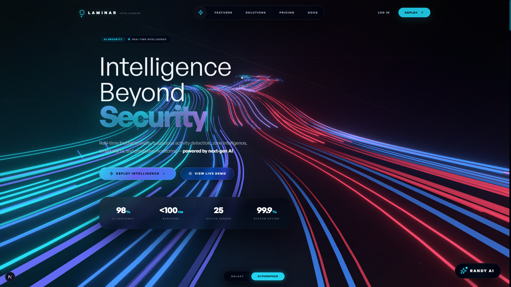

<div align="center">
  
  # 🚀 Laminar

  **Next-Generation AI-Powered Analytics & Vision Intelligence Platform**

  <p align="center">
    
    
    
    
    
    
  </p>

  <h3>Built by <strong>Golla Bhargava Teja</strong></h3>
</div>

---

## 🌟 Overview

**Laminar** is a premium, full‑stack AI operating system for smart cities. It fuses real‑time computer vision, predictive analytics, large language models, and immersive 3D visualizations into a single, ultra‑responsive platform. All LLM capabilities are powered by **Google Gemini API** and **Groq API** – no local Ollama is used.

---

# Complete Features of LAMINAR

| Feature | Description | Technology |
|---------|-------------|------------|
| 👁️ **Real-time Computer Vision** | Object detection, facial recognition, and tracking powered by cutting-edge neural networks. | `YOLOv8`, `OpenCV`, `face-api.js` |
| 🧠 **LLM Integration** | Embedded AI assistant capable of semantic search and context-aware responses without external APIs. | `Open source models-groq`, `Faiss` |
| 🔮 **Predictive Analytics** | Time-series forecasting and anomaly detection to predict surges and identify outliers. | `Prophet`, `Scikit-Learn` |
| 🌍 **Geospatial Intelligence** | Geofencing, zone containment checks, and interactive maps. | `Shapely`, `Leaflet` |
| 📊 **Immersive 3D Dashboard** | Next-generation user interface featuring 3D elements, dynamic animations, and complex data visualization. | `React Three Fiber`, `GSAP` |
| 🛡️ **Robust Architecture** | Scalable, asynchronous backend with a high-performance relational database. | `FastAPI`, `PostgreSQL` |

## Core Platform Features

* Global AI Command Center
* Real‑Time Operational Dashboard
* Multi‑Venue Monitoring
* Live Telemetry Synchronization
* Tactical Intelligence Interface
* Randy AI Multilingual Assistant
* AI‑Based Operational Recommendations
* Real‑Time Alert Management
* Tactical Escalation System
* Executive Intelligence Reporting

---

## Crowd Intelligence Features

* Real‑Time Crowd Monitoring
* Crowd Density Estimation
* Wait‑Time Monitoring
* Crowd Flow Analysis
* Congestion Detection
* Dwell‑Time Intelligence
* Traversal Mapping
* Session Persistence Tracking
* Identity‑Aware Monitoring
* Crowd Saturation Analysis
* Behavioral Analytics
* Crowd Heatmaps
* Zone Occupancy Tracking
* Panic Detection
* Crowd Surge Monitoring
* Optical Flow Analytics
* Surge Velocity Tracking
* Auto‑Dispatch Recommendations

---

## Zero‑Shot Behavioral Intelligence (Pre‑Crime Engine)

* Panic Movement Detection
* Aggression Detection
* Suspicious Motion Analysis
* Abnormal Dispersal Detection
* Violent Behavioral Shift Detection
* Human Intent Understanding
* Crowd Rhythm Modeling
* Motion Velocity Analysis
* Skeleton Tracking
* Pose Estimation Intelligence
* Context‑Aware AI Analysis
* Predictive Escalation Detection

---

## AI Prediction Engine

* Crowd Evolution Prediction
* Risk Trajectory Forecasting
* Congestion Escalation Prediction
* Density Evolution Analysis
* Predictive Risk Scoring
* Transit Intelligence
* Escalation Probability Mapping
* Operational Peak Forecasting
* Temporal Intelligence Modeling
* Predictive Tactical Recommendations

---

## Smart Traffic Intelligence

* Live Vehicle Detection
* Vehicle Counting
* Traffic Congestion Analysis
* Queue Impact Estimation
* Traffic Density Heatmaps
* Speed Estimation
* Flow‑Speed Analysis
* Traffic Telemetry
* Real‑Time Traffic Risk Scoring
* Dynamic Traffic Monitoring
* Multi‑Node Traffic Intelligence

---

## AI Green Wave (Autonomous Emergency Traffic Intelligence)

* Smart Emergency Routing
* Green Corridor Generation
* Traffic Signal Synchronization
* Dynamic Route Optimization
* Ambulance Route Prioritization
* Firetruck Route Coordination
* Emergency Response Optimization
* Autonomous Traffic Clearing
* Smart Traffic Infrastructure Coordination

---

## Smart Parking Intelligence

* Parking Occupancy Detection
* Slot Availability Analysis
* Parking Analytics
* Smart Parking Mapping
* Vehicle Slot Monitoring
* Urban Parking Optimization
* Parking Utilization Intelligence

---

## Incident Intelligence & Mission Control

* Tactical Alert Generation
* Incident Risk Classification
* Emergency Escalation Management
* Situational Intelligence Mapping
* Tactical Dispatch Coordination
* Automated Protocol Activation
* Mission Control Dashboard
* Webhook Integrations
* MQTT Communication
* Emergency SMS Systems
* Secure Email Notifications
* Autonomous Response Coordination
* Tactical Incident Workflows

---

## AI Video Search

* Natural Language Video Search
* Surveillance Footage Intelligence
* Prompt‑Based Search Queries
* Person Search
* Crowd Event Search
* Suspicious Activity Search
* AI Investigation Workflow
* Multimodal Search Intelligence

*Examples:* “Person wearing red shirt”, “Crowding near entrance”, “Individual near gate area”

---

## Guardian Route (AI Personal Safety Escort System)

* “Walk Me Home” AI
* Personal Safety Tracking
* Suspicious Following Detection
* Distress Posture Detection
* SOS Gesture Detection
* Threat Tracking
* Emergency Security Alerts
* Smart Infrastructure Activation
* Live Location Sharing
* Human‑Centered Safety Intelligence

---

## Area Survey & Spatial Intelligence

* Panoramic Spatial Analysis
* Multi‑Camera Fusion
* Area Saturation Detection
* Spatial Crowd Mapping
* Environmental Occupancy Analysis
* Zone Density Analysis
* Tactical Spatial Monitoring
* Large‑Scale Venue Intelligence

---

## Camera & Infrastructure Monitoring

* Camera Health Monitoring
* Stream Availability Checks
* Node Heartbeat Monitoring
* Infrastructure Diagnostics
* Synchronization Monitoring
* Hardware Status Tracking
* Edge Device Monitoring
* Infrastructure Resilience Analytics

---

## Re‑ID & Identity Intelligence

* Person Re‑Identification
* Cross‑Camera Tracking
* Identity Traversal Mapping
* Identity Session Persistence
* Multi‑Camera Identity Correlation
* Movement Intelligence
* Dossier Export System

---

## Access Control & Governance

* Role‑Based Access Control
* Operator Permission Management
* Sector Isolation
* Operational Boundary Assignment
* Governance Matrix
* Distributed Operator Architecture
* Enterprise Security Management

---

## Federated AI Command

* Federated Learning
* Edge AI Synchronization
* Differential Privacy
* Privacy‑Preserving AI
* Distributed Intelligence Systems
* Local AI Model Training
* Secure Intelligence Sharing
* GDPR‑Aware Infrastructure
* Scalable Edge Intelligence

---

## 4D Spatial Playback Engine (The Time Machine Interface)

* Incident Reconstruction
* 3D Scene Generation
* Multi‑Camera Spatial Fusion
* NeRF‑Based Reconstruction
* 3D Gaussian Splatting
* Navigable Incident Playback
* Time Rewind Interface
* Tactical Scene Inspection
* Digital Twin Intelligence

---

## Intelligence Reports & Analytics

* AI‑Generated Tactical Reports
* Crowd Risk Reports
* Incident Summaries
* Predictive Intelligence Reports
* Strategic Recommendations
* Executive Intelligence PDFs
* Operational Analytics
* Exportable Tactical Documents

---

## AI Assistant — Randy AI

* Multilingual AI Assistant
* Natural Language Queries
* Operational Summaries
* Tactical Recommendations
* Real‑Time Intelligence Responses
* Context‑Aware Assistance
* AI Command Interaction

---

## Real‑Time Systems

* WebSocket‑Based Live Systems
* SSE Event Streaming
* Real‑Time Telemetry
* Event‑Driven Infrastructure
* Distributed Monitoring Architecture
* Live Intelligence Synchronization

---

## Technology Stack

### Frontend
* Next.js 16 (React 19)
* Tailwind CSS
* Framer Motion
* GSAP

### Backend
* FastAPI (Async Python)
* PostgreSQL (asyncpg & SQLAlchemy)
* Node.js (auxiliary services)

### AI & Computer Vision
* YOLOv8, OpenCV, TensorFlow, PyTorch
* Pose Estimation, Object Tracking
* **Google Gemini API**
* **Groq API**

### Infrastructure
* Federated Learning, Edge AI
* MQTT, Event‑Driven Systems
* Scalable Telemetry Architecture

---

## Vision of LAMINAR

> “LAMINAR is building the AI operating system for future cities – transforming passive surveillance into predictive, autonomous, and human‑centered urban intelligence.”

---

## 🚀 Getting Started

### Prerequisites
* Python 3.10+
* Node.js 20+
* PostgreSQL Server

### 1. Clone the Repository
```bash
git clone https://github.com/bhargavatejagolla/Laminar.git
cd Laminar
```

### 2. Unified Startup
```bash
# Windows
start.bat
# or directly with Python
python start.py

# Linux/macOS
./start.sh
```
*The script clears stale processes on ports 3000 and 8000 before launching.*

### 3. Access the Platform
* Frontend Dashboard: `http://localhost:3000`
* Backend API Docs: `http://localhost:8000/docs`

---

## 🎯 Architecture Diagram
```mermaid
graph TD
    A[Client UI / Next.js] -->|REST API & WebSockets| B(FastAPI Gateway)
    B --> C[(PostgreSQL)]
    B --> D[YOLOv8 Vision Engine]
    B --> E[LLM & NLP Module (Google Gemini / Groq)]
    B --> F[Predictive Analytics]
    style A fill:#000,stroke:#333,stroke-width:2px,color:#fff
    style B fill:#009688,stroke:#333,stroke-width:2px,color:#fff
    style C fill:#336791,stroke:#333,stroke-width:2px,color:#fff
```

---

## 👨‍💻 Author
**Golla Bhargava Teja** – Platform Architect & Lead Developer. [GitHub](https://github.com/bhargavatejagolla)

---

<div align="center">
  <i>"Transforming streams of data into oceans of intelligence."</i>
</div>

---

## 📸 Landing Page



---

## 🤝 Contributing
Contributions are welcome! Fork, create a feature branch, and submit a pull request. Follow style guidelines and ensure tests pass.

---

## 📄 License
This project is licensed under the MIT License.
