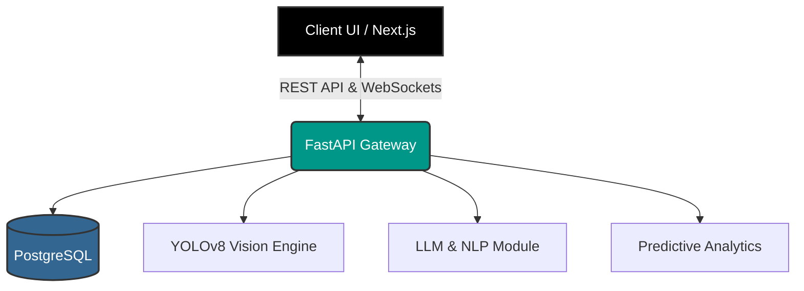

<div align="center">
  
  # 🚀 Laminar

  **Next-Generation AI-Powered Analytics & Vision Intelligence Platform**

  <p align="center">
    
    
    
    
    
    
  </p>

  <h3>Built by <strong>Golla Bhargava Teja</strong></h3>
</div>

---

## 🌟 Overview

Welcome to **Laminar** – a state-of-the-art, full-stack intelligence platform that bridges the gap between raw data and actionable AI-driven insights. Designed for high performance and a seamless user experience, Laminar integrates real-time computer vision, predictive analytics, large language models, and immersive 3D data visualizations into a unified, responsive architecture.

Whether you're processing live video streams with YOLOv8, detecting anomalies with Isolation Forests, forecasting surges with Prophet, or querying your data via an interactive NLP assistant, **Laminar handles it all.**

---

## ⚡ Key Features

| Feature | Description | Technology |
|---------|-------------|------------|
| 👁️ **Real-time Computer Vision** | Object detection, facial recognition, and tracking powered by cutting-edge neural networks. | `YOLOv8`, `OpenCV`, `face-api.js` |
| 🧠 **LLM Integration** | Embedded AI assistant capable of semantic search and context-aware responses without external APIs. | `Open source models-groq`, `Faiss` |
| 🔮 **Predictive Analytics** | Time-series forecasting and anomaly detection to predict surges and identify outliers. | `Prophet`, `Scikit-Learn` |
| 🌍 **Geospatial Intelligence** | Geofencing, zone containment checks, and interactive maps. | `Shapely`, `Leaflet` |
| 📊 **Immersive 3D Dashboard** | Next-generation user interface featuring 3D elements, dynamic animations, and complex data visualization. | `React Three Fiber`, `GSAP` |
| 🛡️ **Robust Architecture** | Scalable, asynchronous backend with a high-performance relational database. | `FastAPI`, `PostgreSQL` |

---

## 🛠️ Technology Stack

### **Frontend (The Canvas)**
- **Framework**: Next.js 16 (React 19)
- **Styling & UI**: Tailwind CSS, Framer Motion, GSAP
- **3D & Rendering**: Three.js, React Three Fiber, OGL
- **Maps & Charts**: React-Leaflet, Recharts, React-Heatmap-Grid
- **State Management**: Zustand, React Query

### **Backend (The Engine)**
- **Framework**: FastAPI (Async Python)
- **Database**: PostgreSQL (via asyncpg & SQLAlchemy)
- **Computer Vision**: Ultralytics (YOLOv8), OpenCV
- **AI & ML**: Llama-CPP, Sentence-Transformers, Faiss, Scikit-learn, Prophet
- **Security**: JWT Authentication, bcrypt, Python-Jose

---

## 🚀 Getting Started

Experience Laminar locally in a few simple steps.

### Prerequisites
- Python 3.10+
- Node.js 20+
- PostgreSQL Server

### 1. Clone the Repository
```bash
git clone https://github.com/bhargavatejagolla/Laminar.git
cd Laminar
```

### 2. Unified Startup
Laminar comes with a unified startup script that automatically launches both the FastAPI backend and the Next.js frontend concurrently.

```bash
# Windows
start.bat
# or directly with python:
python start.py

# Linux/macOS
./start.sh
```
*Note: The unified script will also clear stale processes on ports 3000 and 8000.*

### 3. Access the Platform
- **Frontend Dashboard:** `http://localhost:3000`
- **Backend API Docs (Swagger UI):** `http://localhost:8000/docs`

---

## 🎯 Architecture Diagram



---

## 👨‍💻 Author

**Golla Bhargava Teja**
- Platform Architect & Lead Developer
- [GitHub Profile](https://github.com/bhargavatejagolla)

---

<div align="center">
  <i>"Transforming streams of data into oceans of intelligence."</i>
</div>

---

## 📸 Landing Page


---

## 🤝 Contributing

Contributions are welcome! Please fork the repository, create a feature branch, and submit a pull request. Follow the code style guidelines and ensure all tests pass.

---

## 📄 License

This project is licensed under the MIT License.
