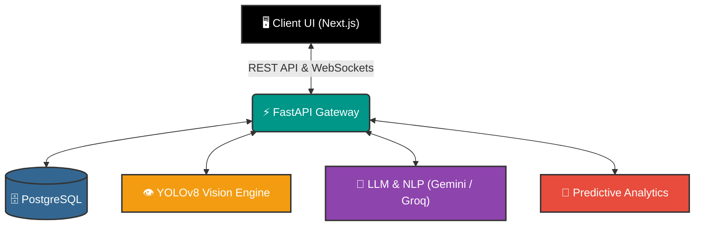

<div align="center">
  
  

  <h2 align="center">Next-Generation AI-Powered Analytics & Vision Intelligence Platform</h2>

  <p align="center">
    <a href="https://python.org"></a>
    <a href="https://fastapi.tiangolo.com/"></a>
    <a href="https://nextjs.org/"></a>
    <a href="https://threejs.org/"></a>
    <a href="https://ultralytics.com/"></a>
    <a href="https://deepmind.google/technologies/gemini/"></a>
  </p>

  <h3>Built with 💡 by <strong>Golla Bhargava Teja</strong></h3>

  <i>"Transforming streams of data into oceans of intelligence."</i>
</div>

---

## 🌟 Overview

**Laminar** is a premium, full‑stack AI operating system built for smart cities. It fuses real‑time computer vision, predictive analytics, large language models, and immersive 3D visualizations into a single, ultra‑responsive platform. 

> **Note:** All LLM capabilities are powered by **Google Gemini API** and **Groq API** – maximizing performance and accuracy without relying on local models.

---

## 📸 Dashboard Interface

<div align="center">
  
</div>

---

## ✨ Complete Features of LAMINAR

| Feature | Description | Technology |
|:---:|---|:---:|
| 👁️ **Real-time Computer Vision** | Object detection, facial recognition, and tracking powered by cutting-edge neural networks. | `YOLOv8/11`, `OpenCV`, `face-api.js` |
| 🧠 **LLM Integration** | Embedded AI assistant capable of semantic search and context-aware responses without external APIs. | `Groq`, `Faiss`, `Google Gemini` |
| 🔮 **Predictive Analytics** | Time-series forecasting and anomaly detection to predict surges and identify outliers. | `Prophet`, `Scikit-Learn` |
| 🌍 **Geospatial Intelligence** | Geofencing, zone containment checks, and interactive maps. | `Shapely`, `Leaflet` |
| 📊 **Immersive 3D Dashboard** | Next-generation user interface featuring 3D elements, dynamic animations, and complex data visualization. | `React Three Fiber`, `GSAP` |
| 🛡️ **Robust Architecture** | Scalable, asynchronous backend with a high-performance relational database. | `FastAPI`, `PostgreSQL` |

---

## 🚀 Deep Dive: Capabilities & Modules

To organize the massive scale of Laminar's capabilities, explore the modules below. We haven't skipped a single feature.

<details open>
<summary><b>🏢 Core Platform Features</b></summary>
<br>

- 🌐 Global AI Command Center
- ⚡ Real‑Time Operational Dashboard
- 🏙️ Multi‑Venue Monitoring
- 🔄 Live Telemetry Synchronization
- 🎯 Tactical Intelligence Interface
- 🤖 Randy AI Multilingual Assistant
- 📈 AI‑Based Operational Recommendations
- 🚨 Real‑Time Alert Management
- 📈 Tactical Escalation System
- 📋 Executive Intelligence Reporting

</details>

<details open>
<summary><b>👥 Crowd Intelligence Features</b></summary>
<br>

- 👁️ Real‑Time Crowd Monitoring
- 📊 Crowd Density Estimation & Heatmaps
- ⏱️ Wait‑Time & Dwell‑Time Intelligence
- 🌊 Crowd Flow & Optical Flow Analytics
- 🚦 Congestion & Panic Detection
- 🚶 Traversal Mapping & Zone Occupancy
- 🆔 Session Persistence & Identity-Aware Monitoring
- ⚠️ Crowd Saturation & Behavioral Analytics
- 🏃 Surge Velocity Tracking
- 🚑 Auto‑Dispatch Recommendations

</details>

<details open>
<summary><b>🕵️‍♂️ Zero‑Shot Behavioral Intelligence (Pre‑Crime Engine)</b></summary>
<br>

- ⚠️ Zero-Shot Panic Dispersal Detection
- 🥊 Predictive Aggression & Altercation Tracking
- 🏃 Panic Movement & Suspicious Motion Analysis
- 📉 Abnormal Dispersal & Violent Behavioral Shift Detection
- 🧠 Human Intent Understanding & Context-Aware Analysis
- 🎶 Crowd Rhythm Modeling
- ⚡ Motion Velocity Analysis
- 🦴 Skeleton Tracking & Pose Estimation Intelligence
- 🔮 Predictive Escalation Detection

</details>

<details open>
<summary><b>📈 AI Prediction Engine</b></summary>
<br>

- 🔮 Crowd Evolution & Risk Trajectory Forecasting
- 📈 Congestion Escalation Prediction
- 📊 Density Evolution Analysis
- ⚠️ Predictive Risk Scoring
- 🚇 Transit Intelligence
- 🗺️ Escalation Probability Mapping
- 📅 Operational Peak Forecasting
- ⏳ Temporal Intelligence Modeling
- 💡 Predictive Tactical Recommendations

</details>

<details open>
<summary><b>🚗 Smart Traffic Intelligence</b></summary>
<br>

- 🚘 Live Vehicle Detection & Counting
- 🚦 Traffic Congestion Analysis & Queue Impact Estimation
- 🗺️ Traffic Density Heatmaps
- ⏱️ Speed Estimation & Flow‑Speed Analysis
- 📡 Traffic Telemetry
- ⚠️ Real‑Time Traffic Risk Scoring
- 🔄 Dynamic Traffic Monitoring & Multi‑Node Intelligence

</details>

<details open>
<summary><b>🚑 AI Green Wave (Autonomous Emergency Traffic Intelligence)</b></summary>
<br>

- 🚨 Smart Emergency Routing
- 🟢 Green Corridor Generation
- 🚦 Traffic Signal Synchronization
- 🗺️ Dynamic Route Optimization
- 🚑 Ambulance & Firetruck Route Prioritization
- ⚡ Emergency Response Optimization
- 🧹 Autonomous Traffic Clearing
- 🏙️ Smart Traffic Infrastructure Coordination

</details>

<details open>
<summary><b>🌉 Resonance Engine (Structural Health Monitoring)</b></summary>
<br>

- 🔍 Eulerian Video Magnification (EVM)
- 📳 Structural Vibration Analysis & Frequency Extraction
- ⚠️ Real-time Resonance Hazard Alerts
- 🌉 Cable-Stayed & Pillar Health Tracking
- 👁️ Visual Displacements Magnification

</details>

<details open>
<summary><b>🌊 Flood Intelligence Network (Multi-Node Omni-Base Calibration)</b></summary>
<br>

- 🌊 Real-Time Flood Severity Index (0-100)
- 💧 Morphological HSV Water Segmentation
- 🛑 Traffic Disruption & Submersion Analytics
- 🚨 AI Green Wave & Emergency Corridor Escalation
- 🚶 Guardian Route Rerouting for Pedestrians
- 📈 Dynamic Rise Trend Monitoring
- 🌐 Incident Hub Command Generation

</details>

<details open>
<summary><b>🅿️ Smart Parking Intelligence</b></summary>
<br>

- 🚗 Parking Occupancy Detection
- 🅿️ Slot Availability Analysis
- 📊 Parking Analytics & Utilization Intelligence
- 🗺️ Smart Parking Mapping
- 🎥 Vehicle Slot Monitoring
- 🏙️ Urban Parking Optimization

</details>

<details open>
<summary><b>🚨 Incident Intelligence & Mission Control</b></summary>
<br>

- 🎙️ **J.A.R.V.I.S. Autonomous Voice Overwatch**: Real-Time Synthesized P.A.
- 🐝 **Hive-Mind Dynamic Evacuation Engine**: Live Safe-Pathing
- 📄 Instant LLM Threat Dossier Generation
- ⚠️ Tactical Alert Generation & Incident Risk Classification
- 🚑 Emergency Escalation Management & Dispatch Coordination
- 🗺️ Situational Intelligence Mapping
- ⚙️ Automated Protocol Activation & Tactical Workflows
- 🖥️ Mission Control Dashboard
- 🔗 Webhook & MQTT Integrations
- 📱 Emergency SMS Systems & Secure Email Notifications
- 🤖 Autonomous Response Coordination
- ⏪ AI Incident Reconstruction Engine
- 🗂️ Automated Evidence Fusion (Video, Logs, Telemetry)
- ⬛ Black Box Incident Auditing & Timelines

</details>

<details open>
<summary><b>🔍 AI Video Search</b></summary>
<br>

- 🗣️ Natural Language Video Search *(e.g., “Person wearing red shirt”, “Crowding near entrance”)*
- 🎥 Surveillance Footage Intelligence
- ⌨️ Prompt‑Based Search Queries
- 👤 Person & Suspicious Activity Search
- 🏟️ Crowd Event Search
- 🕵️‍♂️ AI Investigation Workflow & Multimodal Search Intelligence

</details>

<details open>
<summary><b>🛡️ Guardian Route (AI Personal Safety Escort System)</b></summary>
<br>

- 🚶 “Walk Me Home” AI & Personal Safety Tracking
- 👁️ Suspicious Following Detection
- 🆘 Distress Posture & SOS Gesture Detection
- ⚠️ Threat Tracking & Emergency Security Alerts
- 💡 Smart Infrastructure Activation
- 📍 Live Location Sharing
- 🤝 Human‑Centered Safety Intelligence

</details>

<details open>
<summary><b>🆘 Sentinel Emergency Beacon (Laminar SafeLink)</b></summary>
<br>

- 🚨 **Zero-Friction SOS Generation**: One-touch emergency activation system.
- 📧 **Automated Email Escalation**: Secures the digital liability chain by instantly dispatching incident records to management, supervisors, and authorities via SMTP.
- 📍 **Real-time GPS Capture**: Extracts exact user telemetry and injects it into Google Maps links for immediate response.
- 📁 **Silent Liability Tracking**: Automatically initializes an incident dossier (e.g., `LMNR-EMG-XXXX`) upon activation.

</details>

<details open>
<summary><b>⚕️ AEGIS Protocol (Autonomous Emergency Guidance & Intervention System)</b></summary>
<br>

- 🫀 Medical Event Classification & Cardiac Event Detection
- 🧍 Kinetic Anomaly Tracking (Zero-Shot Fall Detection)
- 📐 Multi-Scale YOLO-Pose Image Pyramid
- 🏥 Automated Hospital & Police Notification via SMTP
- 🚁 AED Drone Launch Authorization
- 🌐 Real-Time Incident Hub Generation
- ⭕ Motionless Progress Ring HUD

</details>

<details open>
<summary><b>🛰️ Area Survey & Spatial Intelligence</b></summary>
<br>

- 🖼️ Panoramic Spatial Analysis & Multi‑Camera Fusion
- 🔴 Area Saturation Detection
- 🗺️ Spatial Crowd & Environmental Occupancy Mapping
- 📊 Zone Density Analysis
- 👁️ Tactical Spatial Monitoring for Large‑Scale Venues

</details>

<details open>
<summary><b>📹 Camera & Infrastructure Monitoring</b></summary>
<br>

- 🏥 Camera Health Monitoring
- 📡 Stream Availability Checks
- ❤️ Node Heartbeat Monitoring
- 🔧 Infrastructure Diagnostics
- ⏱️ Synchronization Monitoring
- 💻 Hardware Status & Edge Device Tracking
- 🛡️ Infrastructure Resilience Analytics

</details>

<details open>
<summary><b>👤 Re‑ID & Identity Intelligence</b></summary>
<br>

- 🔍 Person Re‑Identification
- 🎥 Cross‑Camera Tracking
- 🗺️ Identity Traversal Mapping & Session Persistence
- 🔗 Multi‑Camera Identity Correlation
- 🚶 Movement Intelligence
- 📄 Dossier Export System

</details>

<details open>
<summary><b>🔐 Access Control & Governance</b></summary>
<br>

- 👮 Role‑Based Access Control
- ⚙️ Operator Permission Management
- 🚧 Sector Isolation & Operational Boundary Assignment
- 📊 Governance Matrix
- 🌐 Distributed Operator Architecture
- 🏢 Enterprise Security Management

</details>

<details open>
<summary><b>🧠 Federated AI Command</b></summary>
<br>

- 🌐 Federated Learning & Edge AI Synchronization
- 🔒 Differential Privacy & Privacy‑Preserving AI
- 📡 Distributed Intelligence Systems
- 💻 Local AI Model Training
- 🤝 Secure Intelligence Sharing
- 🇪🇺 GDPR‑Aware Infrastructure & Scalable Edge Intelligence

</details>

<details open>
<summary><b>⏳ 4D Spatial Playback Engine (The Time Machine Interface)</b></summary>
<br>

- ⏪ Incident Reconstruction
- 🧊 3D Scene Generation & Gaussian Splatting
- 🎥 Multi‑Camera Spatial Fusion
- 📸 NeRF‑Based Reconstruction
- 🎮 Navigable Incident Playback
- ⏱️ Time Rewind Interface
- 🕵️‍♂️ Tactical Scene Inspection & Digital Twin Intelligence

</details>

<details open>
<summary><b>📊 Intelligence Reports & Analytics</b></summary>
<br>

- 📝 AI‑Generated Tactical Reports
- ⚠️ Crowd Risk Reports & Incident Summaries
- 🔮 Predictive Intelligence Reports
- 💡 Strategic Recommendations
- 📑 Executive Intelligence PDFs & Exportable Tactical Documents
- 📈 Operational Analytics

</details>

<details open>
<summary><b>🤖 AI Assistant — Randy AI</b></summary>
<br>

- 🌍 Multilingual AI Assistant
- 💬 Natural Language Queries
- 📝 Operational Summaries & Tactical Recommendations
- ⚡ Real‑Time Intelligence Responses
- 🧠 Context‑Aware Assistance
- ⌨️ AI Command Interaction

</details>

<details open>
<summary><b>⚡ Real‑Time Systems</b></summary>
<br>

- 🔌 WebSocket‑Based Live Systems & SSE Event Streaming
- 📊 Real‑Time Telemetry
- ⚡ Event‑Driven Infrastructure
- 🌐 Distributed Monitoring Architecture
- 🔄 Live Intelligence Synchronization

</details>

---

## 🛠️ Technology Stack

<div align="center">

### **Frontend & UI**


### **Backend & Infrastructure**


### **AI & Computer Vision**


</div>

---

## 🌎 The Vision of LAMINAR

> “LAMINAR is building the AI operating system for future cities – transforming passive surveillance into predictive, autonomous, and human‑centered urban intelligence.”

---

## ⚙️ Getting Started

### Prerequisites
- Python 3.10+
- Node.js 20+
- PostgreSQL Server

### 1. Clone the Repository
```bash
git clone https://github.com/bhargavatejagolla/Laminar.git
cd Laminar
```

### 2. Unified Startup
**Windows**
```cmd
start.bat
# or directly with Python
python start.py
```

**Linux/macOS**
```bash
./start.sh
```
*(The start scripts automatically clear stale processes on ports 3000 and 8000 before launching.)*

### 3. Access the Platform
- **Frontend Dashboard:** [http://localhost:3000](http://localhost:3000)
- **Backend API Docs:** [http://localhost:8000/docs](http://localhost:8000/docs)

---

## 🏗️ Architecture Diagram


```mermaid
graph TD
    A["🖥️ Client UI (Next.js)"] <-->|REST API & WebSockets| B("⚡ FastAPI Gateway")
    B <--> C[("🗄️ PostgreSQL")]
    B <--> D["👁️ YOLOv8 Vision Engine"]
    B <--> E["🧠 LLM & NLP (Gemini / Groq)"]
    B <--> F["🔮 Predictive Analytics"]
    
    style A fill:#000,stroke:#333,stroke-width:2px,color:#fff
    style B fill:#009688,stroke:#333,stroke-width:2px,color:#fff
    style C fill:#336791,stroke:#333,stroke-width:2px,color:#fff
    style D fill:#f39c12,stroke:#333,stroke-width:2px,color:#fff
    style E fill:#8e44ad,stroke:#333,stroke-width:2px,color:#fff
    style F fill:#e74c3c,stroke:#333,stroke-width:2px,color:#fff
```

---

## 👨‍💻 Author

<a href="https://github.com/bhargavatejagolla">
  
</a>

**Golla Bhargava Teja**  
*Platform Architect & Lead Developer*  
[GitHub Profile](https://github.com/bhargavatejagolla) | Building the future of urban intelligence.

<br clear="left"/>

---

## 🤝 Contributing

Contributions are always welcome! 
1. Fork the project
2. Create your feature branch (`git checkout -b feature/AmazingFeature`)
3. Commit your changes (`git commit -m 'Add some AmazingFeature'`)
4. Push to the branch (`git push origin feature/AmazingFeature`)
5. Open a Pull Request

---

## 📄 License

This project is licensed under the **MIT License**.

---
<div align="center">
  
</div>
