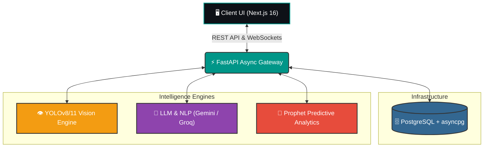

<div align="center">
  
  

  <h2 align="center">Next-Generation AI-Powered Analytics & Vision Intelligence Platform</h2>

  <p align="center">
    <a href="https://github.com/bhargavatejagolla/Laminar/stargazers"></a>
    <a href="https://github.com/bhargavatejagolla/Laminar/network/members"></a>
    <a href="https://github.com/bhargavatejagolla/Laminar/graphs/commit-activity"></a>
    <a href="https://github.com/bhargavatejagolla/Laminar/blob/main/LICENSE"></a>
  </p>

  <p align="center">
    <a href="https://python.org"></a>
    <a href="https://fastapi.tiangolo.com/"></a>
    <a href="https://nextjs.org/"></a>
    <a href="https://threejs.org/"></a>
    <a href="https://ultralytics.com/"></a>
    <a href="https://deepmind.google/technologies/gemini/"></a>
  </p>

  <h3>Built with 💡 by <strong>Golla Bhargava Teja</strong></h3>

  <i>"Transforming streams of data into oceans of intelligence."</i>
</div>

---

<div align="center">
  
</div>

---

## 🌟 The Vision

> **LAMINAR** is building the AI operating system for future cities. We are transforming passive surveillance into **predictive, autonomous, and human‑centered urban intelligence**. 

By fusing real‑time computer vision, predictive analytics, large language models, and immersive 3D visualizations into a single, ultra‑responsive platform, Laminar delivers unprecedented situational awareness and operational command. *(Powered entirely by **Google Gemini API** and **Groq API** for maximum inference speed and reasoning).*

---

## 📖 Table of Contents
- [🌟 The Vision](#-the-vision)
- [✨ Core Innovations](#-core-innovations)
- [🚀 Deep Dive: Modules & Capabilities](#-deep-dive-modules--capabilities)
- [🏗️ Architecture](#️-architecture)
- [⚙️ Quick Start](#️-quick-start)
- [🛠️ Technology Stack](#️-technology-stack)
- [🤝 Contributing](#-contributing)

---

## ✨ Core Innovations

| Paradigm | Technology Focus | Description |
|:---|:---|:---|
| 👁️ **Real-time Computer Vision** | `YOLOv8/11`, `OpenCV`, `face-api.js` | Zero-shot object detection, facial recognition, and tracking powered by hyper-optimized neural networks. |
| 🧠 **Embedded LLM Intelligence** | `Groq`, `Faiss`, `Google Gemini` | Context-aware AI assistant with semantic search, acting as the brain of the platform. |
| 🔮 **Predictive Analytics** | `Prophet`, `Scikit-Learn` | Time-series forecasting and anomaly detection to proactively identify surges and risks. |
| 🌍 **Geospatial & Spatial AI** | `Shapely`, `Leaflet`, `NeRF` | Geofencing, spatial crowd mapping, and physical environment digitization. |
| 📊 **Immersive 3D UI** | `React Three Fiber`, `GSAP` | Next-generation user interface featuring dynamic light pillars, hyperspeed animations, and data topography. |
| 🛡️ **Asynchronous Architecture** | `FastAPI`, `PostgreSQL` | Highly scalable, asynchronous data pipelines with a high-performance relational backend. |

---

## 🚀 Deep Dive: Modules & Capabilities

Laminar is a massive platform encompassing everything from traffic control to emergency medical dispatch. Explore the intelligence modules below.

<details>
<summary><b>🏢 1. Core Platform & Command Center</b></summary>
<blockquote>
The central nervous system of Laminar, providing a unified view of all operational telemetry.
</blockquote>

- 🌐 Global AI Command Center
- ⚡ Real‑Time Operational Dashboard
- 🏙️ Multi‑Venue Monitoring
- 🔄 Live Telemetry Synchronization
- 🎯 Tactical Intelligence Interface
- 🤖 Randy AI Multilingual Assistant
- 📈 AI‑Based Operational Recommendations
- 🚨 Real‑Time Alert Management
- 📈 Tactical Escalation System
- 📋 Executive Intelligence Reporting
</details>

<details>
<summary><b>👥 2. Crowd Intelligence & Dynamics</b></summary>
<blockquote>
Advanced macroscopic tracking of human movement and density.
</blockquote>

- 👁️ Real‑Time Crowd Monitoring
- 📊 Crowd Density Estimation & Heatmaps
- ⏱️ Wait‑Time & Dwell‑Time Intelligence
- 🌊 Crowd Flow & Optical Flow Analytics
- 🚦 Congestion & Panic Detection
- 🚶 Traversal Mapping & Zone Occupancy
- 🆔 Session Persistence & Identity-Aware Monitoring
- ⚠️ Crowd Saturation & Behavioral Analytics
- 🏃 Surge Velocity Tracking
- 🚑 Auto‑Dispatch Recommendations
</details>

<details>
<summary><b>🕵️‍♂️ 3. Zero‑Shot Behavioral Intelligence (Pre‑Crime Engine)</b></summary>
<blockquote>
Predictive intent analysis to stop incidents before they escalate.
</blockquote>

- ⚠️ Zero-Shot Panic Dispersal Detection
- 🥊 Predictive Aggression & Altercation Tracking
- 🏃 Panic Movement & Suspicious Motion Analysis
- 📉 Abnormal Dispersal & Violent Behavioral Shift Detection
- 🧠 Human Intent Understanding & Context-Aware Analysis
- 🎶 Crowd Rhythm Modeling
- ⚡ Motion Velocity Analysis
- 🦴 Skeleton Tracking & Pose Estimation Intelligence
- 🔮 Predictive Escalation Detection
</details>

<details>
<summary><b>📈 4. AI Prediction Engine</b></summary>
<blockquote>
Forecasting the future state of urban environments.
</blockquote>

- 🔮 Crowd Evolution & Risk Trajectory Forecasting
- 📈 Congestion Escalation Prediction
- 📊 Density Evolution Analysis
- ⚠️ Predictive Risk Scoring
- 🚇 Transit Intelligence
- 🗺️ Escalation Probability Mapping
- 📅 Operational Peak Forecasting
- ⏳ Temporal Intelligence Modeling
- 💡 Predictive Tactical Recommendations
</details>

<details>
<summary><b>🚗 5. Smart Traffic & AI Green Wave</b></summary>
<blockquote>
Autonomous emergency routing and hyper-efficient traffic management.
</blockquote>

- 🚘 Live Vehicle Detection & Counting
- 🚦 Traffic Congestion & Queue Impact Estimation
- 🚨 **Smart Emergency Routing & Green Corridor Generation**
- 🟢 Traffic Signal Synchronization
- 🚑 Ambulance & Firetruck Route Prioritization
- ⚡ Emergency Response Optimization & Autonomous Traffic Clearing
- 🔄 Dynamic Traffic Monitoring & Multi‑Node Intelligence
</details>

<details>
<summary><b>🌊 6. Infrastructure & Environmental Hazards</b></summary>
<blockquote>
Resonance tracking and omni-base flood intelligence.
</blockquote>

- 🔍 **Eulerian Video Magnification (EVM)** for visual displacement
- 📳 Structural Vibration Analysis & Frequency Extraction
- 🌉 Cable-Stayed & Pillar Health Tracking
- 🌊 Real-Time Flood Severity Index & Morphological HSV Water Segmentation
- 🛑 Traffic Disruption Analytics & Guardian Route Pedestrian Rerouting
- 📈 Dynamic Rise Trend Monitoring
</details>

<details>
<summary><b>🚨 7. AEGIS Protocol & Mission Control</b></summary>
<blockquote>
Autonomous Emergency Guidance & Intervention System.
</blockquote>

- 🎙️ **J.A.R.V.I.S. Autonomous Voice Overwatch**: Real-Time Synthesized P.A.
- 🐝 **Hive-Mind Dynamic Evacuation Engine**: Live Safe-Pathing
- 🫀 Medical Event Classification & Zero-Shot Fall Detection
- 🚁 AED Drone Launch Authorization & Real-Time Incident Hub Generation
- 📄 Instant LLM Threat Dossier Generation
- 🚑 Emergency Escalation Management & Dispatch Coordination
- ⚙️ Automated Protocol Activation & Tactical Workflows
- 🔗 Webhook, MQTT Integrations, & Emergency SMS Systems
- ⏪ **AI Incident Reconstruction Engine** (Black Box Auditing)
</details>

<details>
<summary><b>🛡️ 8. Personal Safety & Access Control</b></summary>
<blockquote>
Human-centered protection and enterprise-grade governance.
</blockquote>

- 🚶 **Guardian Route**: “Walk Me Home” AI & Personal Safety Tracking
- 🚨 **Sentinel Emergency Beacon**: Zero-Friction SOS Generation with GPS Capture
- 👁️ Suspicious Following & Distress Posture Detection
- 📧 Automated Email Escalation for Liability Tracking
- 👮 Role‑Based Access Control & Sector Isolation
- 🌐 Distributed Operator Architecture & Enterprise Security Management
</details>

<details>
<summary><b>🔍 9. Identity, Search & Spatial Playback</b></summary>
<blockquote>
The ultimate forensic toolkit and 4D time machine interface.
</blockquote>

- 🗣️ **Natural Language Video Search** *(e.g., “Person wearing red shirt running”)*
- 🔍 Person Re‑Identification & Cross‑Camera Tracking
- 🗺️ Identity Traversal Mapping & Session Persistence
- ⏪ **4D Spatial Playback Engine**: Navigable Incident Playback
- 🧊 3D Scene Generation & Gaussian Splatting
- 📸 NeRF‑Based Reconstruction & Digital Twin Intelligence
</details>

<details>
<summary><b>🧠 10. Federated Edge AI & Hardware Monitoring</b></summary>
<blockquote>
Scalable, privacy-preserving infrastructure.
</blockquote>

- 🌐 Federated Learning & Edge AI Synchronization
- 🔒 Differential Privacy & GDPR‑Aware Infrastructure
- 🏥 Camera Health & Stream Availability Checks
- ❤️ Node Heartbeat & Synchronization Monitoring
- 🛡️ Infrastructure Resilience Analytics
</details>

---

## 🏗️ Architecture

Laminar's architecture is built for **millisecond latency** and **massive throughput**, separating the computationally heavy vision models from the async web gateway.


```mermaid
graph TD
    A["🖥️ Client UI (Next.js 16)"] <-->|REST API & WebSockets| B("⚡ FastAPI Async Gateway")
    
    subgraph Infrastructure
        C[("🗄️ PostgreSQL + asyncpg")]
    end
    
    subgraph Intelligence Engines
        D["👁️ YOLOv8/11 Vision Engine"]
        E["🧠 LLM & NLP (Gemini / Groq)"]
        F["🔮 Prophet Predictive Analytics"]
    end
    
    B <--> C
    B <--> D
    B <--> E
    B <--> F
    
    style A fill:#0e1117,stroke:#009688,stroke-width:2px,color:#fff
    style B fill:#009688,stroke:#333,stroke-width:2px,color:#fff
    style C fill:#336791,stroke:#333,stroke-width:2px,color:#fff
    style D fill:#f39c12,stroke:#333,stroke-width:2px,color:#fff
    style E fill:#8e44ad,stroke:#333,stroke-width:2px,color:#fff
    style F fill:#e74c3c,stroke:#333,stroke-width:2px,color:#fff
```

---

## ⚙️ Quick Start

### 📋 Prerequisites
- Python 3.10+
- Node.js 20+
- PostgreSQL Server

### 🛠️ 1. Clone & Setup
```bash
git clone https://github.com/bhargavatejagolla/Laminar.git
cd Laminar
```

### 🚀 2. Unified Startup
Laminar includes smart startup scripts that automatically clear stale processes (ports 3000/8000) and initialize both the backend and frontend simultaneously.

**Windows**
```cmd
start.bat
# or via Python directly:
python start.py
```

**Linux/macOS**
```bash
./start.sh
```

### 🌐 3. Access the Platform
- **Dashboard:** [http://localhost:3000](http://localhost:3000)
- **API Documentation:** [http://localhost:8000/docs](http://localhost:8000/docs)

---

## 🛠️ Technology Stack

<div align="center">

| Area | Technologies |
|:---|:---|
| **🎨 Frontend** |     |
| **⚙️ Backend** |    |
| **🧠 AI & Vision**|    |

</div>

---

## 👨‍💻 Author

<a href="https://github.com/bhargavatejagolla">
  
</a>

**Golla Bhargava Teja**  
*Platform Architect & Lead Developer*  
[GitHub](https://github.com/bhargavatejagolla) • [LinkedIn](https://www.linkedin.com/in/bhargavatejagolla/) *(Let's connect!)*

<br clear="left"/>

> *"The future of urban infrastructure is not just connected; it is intelligent, predictive, and intensely human-focused."*

---

## 🤝 Contributing & License

We welcome contributions to push the boundaries of urban intelligence! 
1. Fork the project
2. Create a feature branch (`git checkout -b feature/NextGenAI`)
3. Commit your changes (`git commit -m 'Add NextGenAI module'`)
4. Push to the branch (`git push origin feature/NextGenAI`)
5. Open a Pull Request

This project is licensed under the **MIT License**.

---
<div align="center">
  
</div>
