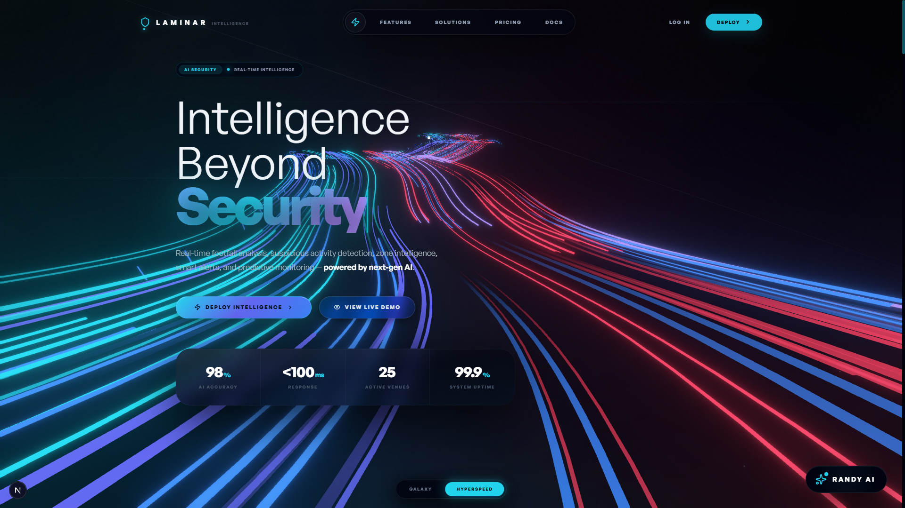
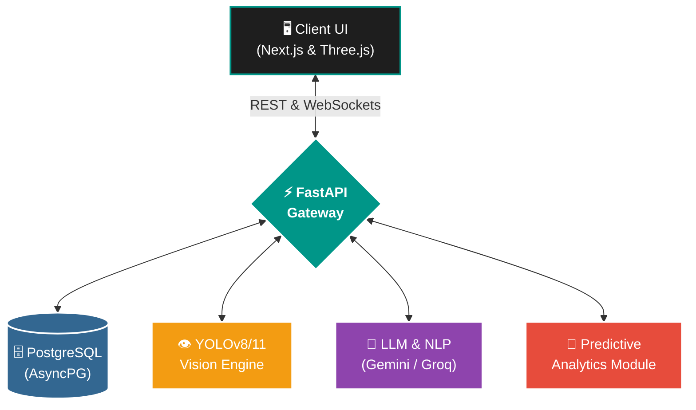

<div align="center">
  
  

  <a href="https://github.com/bhargavatejagolla/Laminar">
    
  </a>

  <br />

  <p align="center">
    <a href="https://github.com/bhargavatejagolla/Laminar/stargazers"></a>
    <a href="https://github.com/bhargavatejagolla/Laminar/network/members"></a>
    <a href="https://github.com/bhargavatejagolla/Laminar/issues"></a>
    <a href="https://github.com/bhargavatejagolla/Laminar/blob/main/LICENSE"></a>
  </p>

  <p align="center">
    
    
    
    
    
    
  </p>

  <h3>Architected with 💡 by <strong><a href="https://github.com/bhargavatejagolla" target="_blank">Golla Bhargava Teja</a></strong></h3>

  <i>"Transforming streams of data into oceans of intelligence."</i>
</div>

<br />

<div align="center">
  
</div>

## 📑 Table of Contents
- [🌟 Overview](#-overview)
- [📸 Dashboard Interface](#-dashboard-interface)
- [✨ Complete Features of LAMINAR](#-complete-features-of-laminar)
- [🚀 Deep Dive: Capabilities & Modules](#-deep-dive-capabilities--modules)
- [🛠️ Technology Stack](#️-technology-stack)
- [🌎 The Vision of LAMINAR](#-the-vision-of-laminar)
- [⚙️ Getting Started](#️-getting-started)
- [🏗️ Architecture Diagram](#️-architecture-diagram)
- [👨‍💻 Author](#-author)

<div align="center">
  
</div>

## 🌟 Overview

**Laminar** is a premium, full‑stack AI operating system meticulously engineered for smart cities and autonomous enterprise monitoring. It seamlessly fuses real‑time computer vision, predictive analytics, large language models, and immersive 3D visualizations into a single, ultra‑responsive platform. 

> **Note on Intelligence:** All LLM capabilities are powered by **Google Gemini API** and **Groq API** – intentionally designed to maximize performance, reasoning capabilities, and accuracy without relying on local open-source overhead.

<div align="center">
  
</div>

## 📸 Dashboard Interface

A glimpse into the command center. The interface leverages Next.js and Three.js for a fluid, next-generation operational experience.

<div align="center">
  
</div>

<div align="center">
  
</div>

## ✨ Complete Features of LAMINAR

| Core Vector | Description | Technology Stack |
|:---:|---|:---:|
| 👁️ **Real-time Computer Vision** | Object detection, facial recognition, and tracking powered by cutting-edge neural networks. | `YOLOv8/11`, `OpenCV`, `face-api.js` |
| 🧠 **LLM Integration** | Embedded AI assistant capable of semantic search and context-aware responses without external APIs. | `Groq`, `Faiss`, `Google Gemini` |
| 🔮 **Predictive Analytics** | Time-series forecasting and anomaly detection to predict surges and identify outliers. | `Prophet`, `Scikit-Learn` |
| 🌍 **Geospatial Intelligence** | Geofencing, zone containment checks, and interactive maps. | `Shapely`, `Leaflet` |
| 📊 **Immersive 3D Dashboard** | Next-generation user interface featuring 3D elements, dynamic animations, and complex data visualization. | `React Three Fiber`, `GSAP` |
| 🛡️ **Robust Architecture** | Scalable, asynchronous backend with a high-performance relational database. | `FastAPI`, `PostgreSQL` |

<div align="center">
  
</div>

## 🚀 Deep Dive: Capabilities & Modules

To organize the massive scale of Laminar's capabilities, we have structured the engine into distinct, specialized intelligence modules. 

> *Every single feature listed below is an active module within the Laminar ecosystem.*

<br>

<details open>
<summary><b><h3 style="display:inline-block; margin: 0;">🏢 Core Platform Features</h3></b></summary>
<blockquote style="border-left: 4px solid #009688;">
  
- 💠 **Global AI Command Center**
- 💠 **Real‑Time Operational Dashboard**
- 💠 **Multi‑Venue Monitoring**
- 💠 **Live Telemetry Synchronization**
- 💠 **Tactical Intelligence Interface**
- 💠 **Randy AI Multilingual Assistant**
- 💠 **AI‑Based Operational Recommendations**
- 💠 **Real‑Time Alert Management**
- 💠 **Tactical Escalation System**
- 💠 **Executive Intelligence Reporting**

</blockquote>
</details>

<details>
<summary><b><h3 style="display:inline-block; margin: 0;">👥 Crowd Intelligence Features</h3></b></summary>
<blockquote style="border-left: 4px solid #009688;">

- 👁️ **Real‑Time Crowd Monitoring**
- 📊 **Crowd Density Estimation**
- ⏱️ **Wait‑Time Monitoring**
- 🌊 **Crowd Flow Analysis**
- 🚦 **Congestion Detection**
- ⏳ **Dwell‑Time Intelligence**
- 🚶 **Traversal Mapping**
- 🆔 **Session Persistence Tracking**
- 🔍 **Identity‑Aware Monitoring**
- ⚠️ **Crowd Saturation Analysis**
- 🧠 **Behavioral Analytics**
- 🌡️ **Crowd Heatmaps**
- 📍 **Zone Occupancy Tracking**
- 🚨 **Panic Detection**
- 🏃 **Crowd Surge Monitoring**
- 🌊 **Optical Flow Analytics**
- ⚡ **Surge Velocity Tracking**
- 🚑 **Auto‑Dispatch Recommendations**

</blockquote>
</details>

<details>
<summary><b><h3 style="display:inline-block; margin: 0;">🕵️‍♂️ Zero‑Shot Behavioral Intelligence (Pre‑Crime Engine)</h3></b></summary>
<blockquote style="border-left: 4px solid #009688;">

- ⚠️ **Zero-Shot Panic Dispersal Detection**
- 🥊 **Predictive Aggression & Altercation Tracking**
- 🏃 **Panic Movement Detection**
- 💥 **Aggression Detection**
- 🕵️ **Suspicious Motion Analysis**
- 📉 **Abnormal Dispersal Detection**
- ⚠️ **Violent Behavioral Shift Detection**
- 🧠 **Human Intent Understanding**
- 🎶 **Crowd Rhythm Modeling**
- ⚡ **Motion Velocity Analysis**
- 🦴 **Skeleton Tracking**
- 📐 **Pose Estimation Intelligence**
- 🌐 **Context‑Aware AI Analysis**
- 🔮 **Predictive Escalation Detection**

</blockquote>
</details>

<details>
<summary><b><h3 style="display:inline-block; margin: 0;">📈 AI Prediction Engine</h3></b></summary>
<blockquote style="border-left: 4px solid #009688;">

- 🔮 **Crowd Evolution Prediction**
- 📈 **Risk Trajectory Forecasting**
- ⚠️ **Congestion Escalation Prediction**
- 📊 **Density Evolution Analysis**
- 🎯 **Predictive Risk Scoring**
- 🚇 **Transit Intelligence**
- 🗺️ **Escalation Probability Mapping**
- 📅 **Operational Peak Forecasting**
- ⏳ **Temporal Intelligence Modeling**
- 💡 **Predictive Tactical Recommendations**

</blockquote>
</details>

<details>
<summary><b><h3 style="display:inline-block; margin: 0;">🚗 Smart Traffic Intelligence</h3></b></summary>
<blockquote style="border-left: 4px solid #009688;">

- 🚘 **Live Vehicle Detection**
- 🔢 **Vehicle Counting**
- 🚦 **Traffic Congestion Analysis**
- 📉 **Queue Impact Estimation**
- 🗺️ **Traffic Density Heatmaps**
- ⏱️ **Speed Estimation**
- 🌊 **Flow‑Speed Analysis**
- 📡 **Traffic Telemetry**
- ⚠️ **Real‑Time Traffic Risk Scoring**
- 🔄 **Dynamic Traffic Monitoring**
- 🌐 **Multi‑Node Traffic Intelligence**

</blockquote>
</details>

<details>
<summary><b><h3 style="display:inline-block; margin: 0;">🚑 AI Green Wave (Autonomous Emergency Traffic Intelligence)</h3></b></summary>
<blockquote style="border-left: 4px solid #009688;">

- 🚨 **Smart Emergency Routing**
- 🟢 **Green Corridor Generation**
- 🚦 **Traffic Signal Synchronization**
- 🗺️ **Dynamic Route Optimization**
- 🚑 **Ambulance Route Prioritization**
- 🚒 **Firetruck Route Coordination**
- ⚡ **Emergency Response Optimization**
- 🧹 **Autonomous Traffic Clearing**
- 🏙️ **Smart Traffic Infrastructure Coordination**

</blockquote>
</details>

<details>
<summary><b><h3 style="display:inline-block; margin: 0;">🌉 Resonance Engine (Structural Health Monitoring)</h3></b></summary>
<blockquote style="border-left: 4px solid #009688;">

- 🔍 **Eulerian Video Magnification (EVM)**
- 📳 **Structural Vibration Analysis & Frequency Extraction**
- ⚠️ **Real-time Resonance Hazard Alerts**
- 🌉 **Cable-Stayed & Pillar Health Tracking**
- 👁️ **Visual Displacements Magnification**

</blockquote>
</details>

<details>
<summary><b><h3 style="display:inline-block; margin: 0;">🌊 Flood Intelligence Network (Multi-Node Omni-Base Calibration)</h3></b></summary>
<blockquote style="border-left: 4px solid #009688;">

- 🌊 **Real-Time Flood Severity Index (0-100)**
- 💧 **Morphological HSV Water Segmentation**
- 🛑 **Traffic Disruption & Submersion Analytics**
- 🚨 **AI Green Wave & Emergency Corridor Escalation**
- 🚶 **Guardian Route Rerouting for Pedestrians**
- 📈 **Dynamic Rise Trend Monitoring**
- 🌐 **Incident Hub Command Generation**

</blockquote>
</details>

<details>
<summary><b><h3 style="display:inline-block; margin: 0;">🅿️ Smart Parking Intelligence</h3></b></summary>
<blockquote style="border-left: 4px solid #009688;">

- 🚗 **Parking Occupancy Detection**
- 🅿️ **Slot Availability Analysis**
- 📊 **Parking Analytics**
- 🗺️ **Smart Parking Mapping**
- 🎥 **Vehicle Slot Monitoring**
- 🏙️ **Urban Parking Optimization**
- 📈 **Parking Utilization Intelligence**

</blockquote>
</details>

<details>
<summary><b><h3 style="display:inline-block; margin: 0;">🚨 Incident Intelligence & Mission Control</h3></b></summary>
<blockquote style="border-left: 4px solid #009688;">

- 🎙️ **J.A.R.V.I.S. Autonomous Voice Overwatch**: *(Real-Time Synthesized P.A.)*
- 🐝 **Hive-Mind Dynamic Evacuation Engine**: *(Live Safe-Pathing)*
- 📄 **Instant LLM Threat Dossier Generation**
- ⚠️ **Tactical Alert Generation**
- 📊 **Incident Risk Classification**
- 🚑 **Emergency Escalation Management**
- 🗺️ **Situational Intelligence Mapping**
- 📞 **Tactical Dispatch Coordination**
- ⚙️ **Automated Protocol Activation**
- 🖥️ **Mission Control Dashboard**
- 🔗 **Webhook Integrations**
- 📡 **MQTT Communication**
- 📱 **Emergency SMS Systems**
- 📧 **Secure Email Notifications**
- 🤖 **Autonomous Response Coordination**
- 📋 **Tactical Incident Workflows**
- ⏪ **AI Incident Reconstruction Engine**
- 🗂️ **Automated Evidence Fusion**: *(Video, Logs, Telemetry)*
- ⬛ **Black Box Incident Auditing & Timelines**

</blockquote>
</details>

<details>
<summary><b><h3 style="display:inline-block; margin: 0;">🔍 AI Video Search</h3></b></summary>
<blockquote style="border-left: 4px solid #009688;">

- 🗣️ **Natural Language Video Search**
- 🎥 **Surveillance Footage Intelligence**
- ⌨️ **Prompt‑Based Search Queries**
- 👤 **Person Search**
- 🏟️ **Crowd Event Search**
- 🕵️ **Suspicious Activity Search**
- 📋 **AI Investigation Workflow**
- 🧠 **Multimodal Search Intelligence**

*Examples:* `"Person wearing red shirt"`, `"Crowding near entrance"`, `"Individual near gate area"`

</blockquote>
</details>

<details>
<summary><b><h3 style="display:inline-block; margin: 0;">🛡️ Guardian Route (AI Personal Safety Escort System)</h3></b></summary>
<blockquote style="border-left: 4px solid #009688;">

- 🚶 **“Walk Me Home” AI**
- 📍 **Personal Safety Tracking**
- 👁️ **Suspicious Following Detection**
- 🆘 **Distress Posture Detection**
- ✋ **SOS Gesture Detection**
- ⚠️ **Threat Tracking**
- 🚨 **Emergency Security Alerts**
- 💡 **Smart Infrastructure Activation**
- 🗺️ **Live Location Sharing**
- 🤝 **Human‑Centered Safety Intelligence**

</blockquote>
</details>

<details>
<summary><b><h3 style="display:inline-block; margin: 0;">🆘 Sentinel Emergency Beacon (Laminar SafeLink)</h3></b></summary>
<blockquote style="border-left: 4px solid #009688;">

- 🚨 **Zero-Friction SOS Generation**: One-touch emergency activation system.
- 📧 **Automated Email Escalation**: Secures the digital liability chain by instantly dispatching incident records to management, supervisors, and authorities via SMTP.
- 📍 **Real-time GPS Capture**: Extracts exact user telemetry and injects it into Google Maps links for immediate response.
- 📁 **Silent Liability Tracking**: Automatically initializes an incident dossier (e.g., `LMNR-EMG-XXXX`) upon activation.

</blockquote>
</details>

<details>
<summary><b><h3 style="display:inline-block; margin: 0;">⚕️ AEGIS Protocol (Autonomous Emergency Guidance & Intervention System)</h3></b></summary>
<blockquote style="border-left: 4px solid #009688;">

- 🫀 **Medical Event Classification & Cardiac Event Detection**
- 🧍 **Kinetic Anomaly Tracking (Zero-Shot Fall Detection)**
- 📐 **Multi-Scale YOLO-Pose Image Pyramid**
- 🏥 **Automated Hospital & Police Notification via SMTP**
- 🚁 **AED Drone Launch Authorization**
- 🌐 **Real-Time Incident Hub Generation**
- ⭕ **Motionless Progress Ring HUD**

</blockquote>
</details>

<details>
<summary><b><h3 style="display:inline-block; margin: 0;">🛰️ Area Survey & Spatial Intelligence</h3></b></summary>
<blockquote style="border-left: 4px solid #009688;">

- 🖼️ **Panoramic Spatial Analysis**
- 🎥 **Multi‑Camera Fusion**
- 🔴 **Area Saturation Detection**
- 🗺️ **Spatial Crowd Mapping**
- 📊 **Environmental Occupancy Analysis**
- 📍 **Zone Density Analysis**
- 👁️ **Tactical Spatial Monitoring**
- 🏟️ **Large‑Scale Venue Intelligence**

</blockquote>
</details>

<details>
<summary><b><h3 style="display:inline-block; margin: 0;">📹 Camera & Infrastructure Monitoring</h3></b></summary>
<blockquote style="border-left: 4px solid #009688;">

- 🏥 **Camera Health Monitoring**
- 📡 **Stream Availability Checks**
- ❤️ **Node Heartbeat Monitoring**
- 🔧 **Infrastructure Diagnostics**
- ⏱️ **Synchronization Monitoring**
- 💻 **Hardware Status Tracking**
- 📱 **Edge Device Monitoring**
- 🛡️ **Infrastructure Resilience Analytics**

</blockquote>
</details>

<details>
<summary><b><h3 style="display:inline-block; margin: 0;">👤 Re‑ID & Identity Intelligence</h3></b></summary>
<blockquote style="border-left: 4px solid #009688;">

- 🔍 **Person Re‑Identification**
- 🎥 **Cross‑Camera Tracking**
- 🗺️ **Identity Traversal Mapping**
- 🆔 **Identity Session Persistence**
- 🔗 **Multi‑Camera Identity Correlation**
- 🚶 **Movement Intelligence**
- 📄 **Dossier Export System**

</blockquote>
</details>

<details>
<summary><b><h3 style="display:inline-block; margin: 0;">🔐 Access Control & Governance</h3></b></summary>
<blockquote style="border-left: 4px solid #009688;">

- 👮 **Role‑Based Access Control**
- ⚙️ **Operator Permission Management**
- 🚧 **Sector Isolation**
- 📍 **Operational Boundary Assignment**
- 📊 **Governance Matrix**
- 🌐 **Distributed Operator Architecture**
- 🏢 **Enterprise Security Management**

</blockquote>
</details>

<details>
<summary><b><h3 style="display:inline-block; margin: 0;">🧠 Federated AI Command</h3></b></summary>
<blockquote style="border-left: 4px solid #009688;">

- 🌐 **Federated Learning**
- ⚡ **Edge AI Synchronization**
- 🔒 **Differential Privacy**
- 🛡️ **Privacy‑Preserving AI**
- 📡 **Distributed Intelligence Systems**
- 💻 **Local AI Model Training**
- 🤝 **Secure Intelligence Sharing**
- 🇪🇺 **GDPR‑Aware Infrastructure**
- 📈 **Scalable Edge Intelligence**

</blockquote>
</details>

<details>
<summary><b><h3 style="display:inline-block; margin: 0;">⏳ 4D Spatial Playback Engine (The Time Machine Interface)</h3></b></summary>
<blockquote style="border-left: 4px solid #009688;">

- ⏪ **Incident Reconstruction**
- 🧊 **3D Scene Generation**
- 🎥 **Multi‑Camera Spatial Fusion**
- 📸 **NeRF‑Based Reconstruction**
- 🎮 **3D Gaussian Splatting**
- 🕹️ **Navigable Incident Playback**
- ⏱️ **Time Rewind Interface**
- 🕵️ **Tactical Scene Inspection**
- 👯 **Digital Twin Intelligence**

</blockquote>
</details>

<details>
<summary><b><h3 style="display:inline-block; margin: 0;">📊 Intelligence Reports & Analytics</h3></b></summary>
<blockquote style="border-left: 4px solid #009688;">

- 📝 **AI‑Generated Tactical Reports**
- ⚠️ **Crowd Risk Reports**
- 📑 **Incident Summaries**
- 🔮 **Predictive Intelligence Reports**
- 💡 **Strategic Recommendations**
- 📄 **Executive Intelligence PDFs**
- 📈 **Operational Analytics**
- 💾 **Exportable Tactical Documents**

</blockquote>
</details>

<details>
<summary><b><h3 style="display:inline-block; margin: 0;">🤖 AI Assistant — Randy AI</h3></b></summary>
<blockquote style="border-left: 4px solid #009688;">

- 🌍 **Multilingual AI Assistant**
- 💬 **Natural Language Queries**
- 📝 **Operational Summaries**
- 💡 **Tactical Recommendations**
- ⚡ **Real‑Time Intelligence Responses**
- 🧠 **Context‑Aware Assistance**
- ⌨️ **AI Command Interaction**

</blockquote>
</details>

<details>
<summary><b><h3 style="display:inline-block; margin: 0;">⚡ Real‑Time Systems</h3></b></summary>
<blockquote style="border-left: 4px solid #009688;">

- 🔌 **WebSocket‑Based Live Systems**
- 📡 **SSE Event Streaming**
- 📊 **Real‑Time Telemetry**
- ⚡ **Event‑Driven Infrastructure**
- 🌐 **Distributed Monitoring Architecture**
- 🔄 **Live Intelligence Synchronization**

</blockquote>
</details>

<div align="center">
  
</div>

## 🛠️ Technology Stack

We constructed LAMINAR on a robust, highly-concurrent architecture utilizing the pinnacle of modern frameworks.

<div align="center">

### 🎨 **Frontend & Visual Engine**


### ⚙️ **Backend & Infrastructure**


### 🧠 **AI, Vision & Deep Learning**


</div>

<div align="center">
  
</div>

## 🌎 The Vision of LAMINAR

> <h3 align="center">“LAMINAR is building the AI operating system for future cities – transforming passive surveillance into predictive, autonomous, and human‑centered urban intelligence.”</h3>

<div align="center">
  
</div>

## ⚙️ Getting Started

Follow these steps to ignite the Laminar core on your local machine.

### Prerequisites
- **Python:** `3.10+`
- **Node.js:** `20+`
- **Database:** `PostgreSQL Server`

### 1️⃣ Clone the Repository
```bash
git clone https://github.com/bhargavatejagolla/Laminar.git
cd Laminar
```

### 2️⃣ Unified Startup
Launch the platform with a single command. *The scripts automatically isolate and terminate stale processes on ports `3000` and `8000`.*

**Windows**
```cmd
start.bat
# OR launch core directly:
python start.py
```

**Linux / macOS**
```bash
chmod +x start.sh
./start.sh
```

### 3️⃣ Access the Command Center
- 🖥️ **Frontend Interface:** [http://localhost:3000](http://localhost:3000)
- 🔌 **Backend API Engine:** [http://localhost:8000/docs](http://localhost:8000/docs)

<div align="center">
  
</div>

## 🏗️ Architecture Diagram

A high-level view of how Laminar's microservices and intelligence engines interact in real-time.


```mermaid
graph TD
    classDef client fill:#1E1E1E,stroke:#009688,stroke-width:2px,color:#fff
    classDef gateway fill:#009688,stroke:#fff,stroke-width:2px,color:#fff,font-weight:bold
    classDef db fill:#336791,stroke:#fff,stroke-width:2px,color:#fff
    classDef vision fill:#f39c12,stroke:#fff,stroke-width:2px,color:#fff
    classDef llm fill:#8e44ad,stroke:#fff,stroke-width:2px,color:#fff
    classDef predict fill:#e74c3c,stroke:#fff,stroke-width:2px,color:#fff

    A["🖥️ Client UI<br/>(Next.js & Three.js)"]:::client <-->|REST & WebSockets| B{"⚡ FastAPI<br/>Gateway"}:::gateway
    
    B <--> C[("🗄️ PostgreSQL<br/>(AsyncPG)")]:::db
    B <--> D["👁️ YOLOv8/11<br/>Vision Engine"]:::vision
    B <--> E["🧠 LLM & NLP<br/>(Gemini / Groq)"]:::llm
    B <--> F["🔮 Predictive<br/>Analytics Module"]:::predict
```

<div align="center">
  
</div>

## 👨‍💻 Author

<a href="https://github.com/bhargavatejagolla">
  
</a>

<div style="padding-left: 120px;">
  <h2 style="margin-bottom: 0;">Golla Bhargava Teja</h2>
  <i>Platform Architect, Visionary & Lead Developer</i>
  <br/><br/>
  Building the future of predictive urban intelligence and scalable AI architectures. <br/>
  <b><a href="https://github.com/bhargavatejagolla">🌐 View GitHub Profile</a></b>
</div>

<br clear="left"/>

<div align="center">
  
</div>

## 🤝 Contributing

We welcome absolute excellence. If you wish to contribute to the Laminar core:
1. **Fork** the project architecture.
2. **Branch** out for your feature (`git checkout -b feature/QuantumEnhancement`).
3. **Commit** with precision (`git commit -m 'feat: Add QuantumEnhancement logic'`).
4. **Push** to the origin (`git push origin feature/QuantumEnhancement`).
5. Open a **Pull Request** for architectural review.

<div align="center">
  
</div>

## 📄 License

This software operates under the robust framework of the **MIT License**.

<div align="center">
  
</div>
